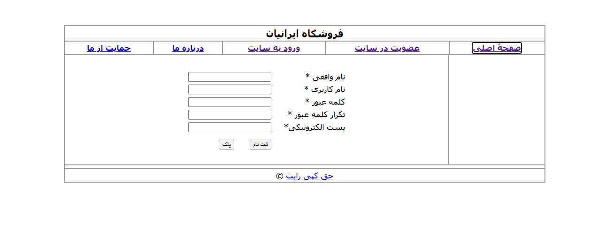

# پروژه فروشگاه ایرانیان شاپ 🛒

این پروژه مربوط به درس **طراحی وب یازدهم** است و به عنوان پروژه‌ی پایانی کتاب انجام شده است.

## توضیحات پروژه:
- طراحی وب‌سایت فروشگاهی ساده
- استفاده از HTML و CSS و php
- بخش‌های مختلف مانند: صفحه اصلی، محصولات، درباره ما و تماس با ما

## هدف:
آشنایی با ساختار وب‌سایت و طراحی صفحات وب با استفاده از کد.

## ساخته شده توسط:
🎓 دانش‌آموز پایه یازدهم

محمد بیارش 

## پیش‌نمایش پروژه 📸

